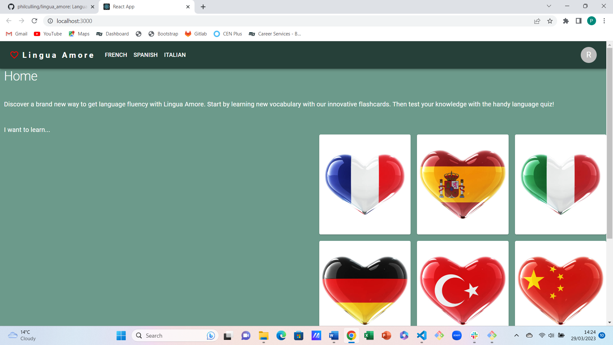
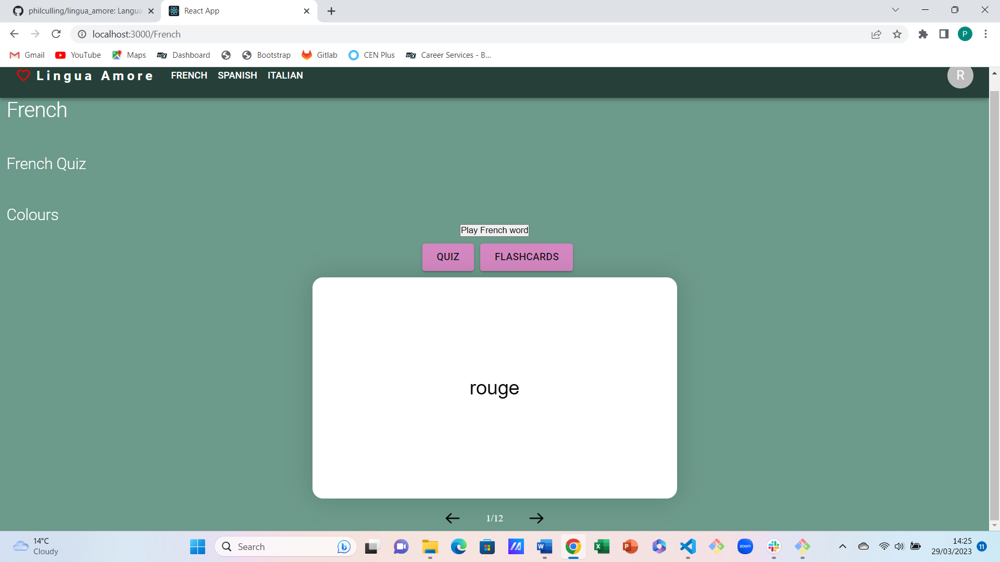
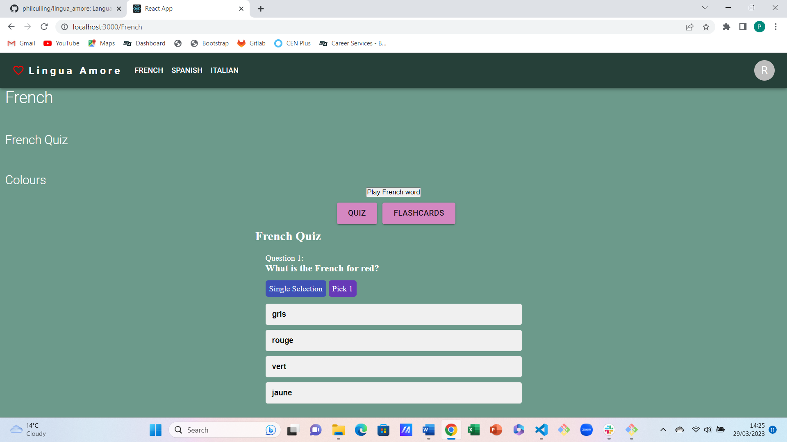

# Final Projects: lingua_amore
Project 2, building a client-side single-page application.

Team: Musleha, Nailah and Phil

## Description
- We wanted to create a user friendly language learning site using REACT and deployed to Netlify.
- We wanted the site to contain a home page with a choice of several languages to learn. The available languages are represented by flags of countries in a heart shape.
- Our MVP is to develop a functioning page for learning French. Once fully developed, each language would subdivide into topics. For demonstration purposes, we have chosen colours.
- There are demonstration pages for Spanish and Italian.

- We wanted to develop our skills of using REACT.
- We wanted to research and use at least 2 technologies that we had not used before.
- Our new technologies were:
    - npm react-quiz-component
    - npm react-quizlet-flashcard
    - Material-UI styling engine
- We wanted to develop our skills of using github branching workflow.
- We wanted to develop our skills of agile software development.
- We wanted to deploy our finished product to Netlify and check it had no errors.

## Installation
n/a

## Usage
- The user chooses a language either from the navbar or by clicking on the heart shaped flags.
- Once on the topic page, the user can choose between the default option of Flashcards, or a Quiz.
- Each topic contains a number of flashcards. When a flashcard is clicked on, it flips to show the translation. The user can scroll from one flashcard to the next using the arrows that are below the flashcards.
- The user can play an audio clip of the word in the target language.
- The user can choose at any point to take part in the quiz. The quiz generates questions in a multiple choice format. Once completed, scores are displayed and the user is able to look through correct and incorrect answers to assist their learning.

The site is published at https://beamish-sprite-6f8b41.netlify.app

Screenshots:

## Credits

## License
Site is published using the MIT licence.